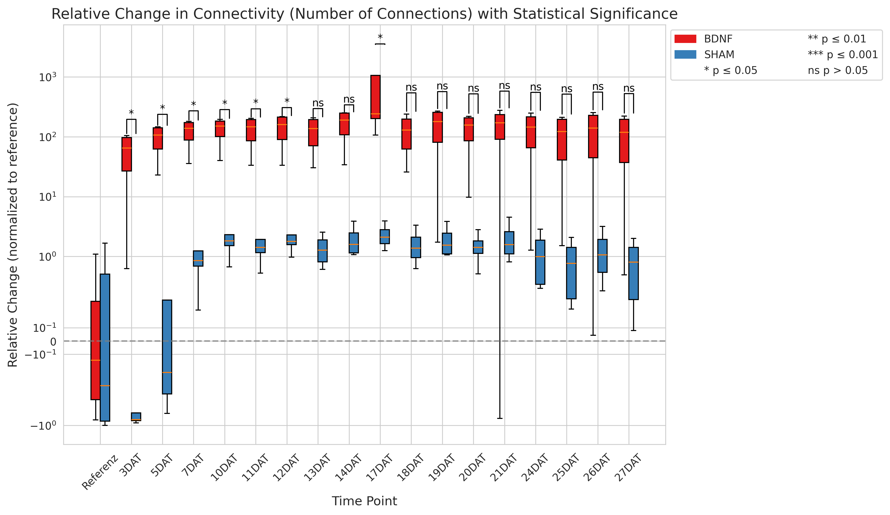

# MEAanalyzer


A containerized pipeline for analyzing Multi-Electrode Array (MEA) recordings with automated burst detection, feature calculation, visualization, and statistical analysis.

## Overview

MEAanalyzer is a comprehensive tool for neuronal activity analysis from MEA recordings. It performs:

- Burst detection (single-electrode and network-level)
- Feature calculation (spike rates, ISI, synchrony measures)
- Visualization (raster plots, boxplots, connectivity graphs)
- Statistical analysis between experimental groups

### Spike Detection Options

Before running MEAanalyzer, you need spike-detected MEA recordings. You have two options:

1. **Open-source method**: Use our companion spike detection repository [MEAexplorer](https://github.com/tivenide/MEAexplorer) to process raw MEA recordings (.brw) and generate .bxr files with detected spikes. This Repo was also developed in the BioMEMS Lab of TH-AB.

2. **Commercial software**: Alternatively, use BrainWave 5 from 3Brain, which offers comprehensive spike detection capabilities. If your files already contain spike detection through BrainWave 5, you can skip the `append_bursts_computeIntense.py` or `append_bursts.py` modules in the pipeline, as burst detection will be handled directly from the pre-processed files.

Choose the option that best fits your workflow and data processing needs.

## Getting Started

### Prerequisites

- [Docker](https://docs.docker.com/get-docker/) installed on your system
- MEA recording data in .bxr format
- Make sure to have your Chip ID in the file names! E.g. *ID2024-0X* or *ID2024-01_yourFilenamewhatever.bxr*

### Clone the Repository

```bash
git clone https://github.com/yourusername/MEAanalyzer.git
cd MEAanalyzer
```
Make sure to edit your UID in the Dockerfile therefor:
```bash
echo $UID
```
The number which you get e.g. 1009 need to be placed in the Dockerfile under:

```bash
RUN adduser -u <YOURUIDHERE> --disabled-password --gecos "" appuser && chown -R appuser /app 
```


### Build the Docker Container

```bash
docker build -t meaanalyzer:latest .
```

To rebuild the container after changes:

```bash
docker rmi -f meaanalyzer:latest && docker build -t meaanalyzer:latest .
```

### Input Data Structure

The pipeline requires a specific folder structure for proper analysis:

```
data/
├── labels.txt (optional)
├── GROUP1/              # Experimental group (e.g., "SHAM", "BDNF")
│   ├── ID2024-01/       # Individual sample identifier
│   │   ├── file1.bxr    # MEA recording files
│   │   └── file2.bxr
│   └── ID2024-03/
│       ├── file1.bxr
│       └── file2.bxr
└── GROUP2/
    ├── ID2024-02/
    │   ├── file1.bxr
    │   └── file2.bxr
    └── ID2024-04/
        ├── file1.bxr
        └── file2.bxr
```

**Important Notes:**
- Group folders represent experimental conditions
- ID folders represent individual samples/chips
- Files are processed in alphabetical order and treated as sequential time points
- You can optionally include a `labels.txt` file in the data directory with semicolon-separated labels for timepoints. Make sure to have an equal amount of files in each Chip-Folder. Make also sure to provide the same amount of labels in your `labels.txt`, otherwise it will not be used.

### Create Folder Structure (Example)

**Option 1 (Recommended)**

Adapt the HEAD of `folder_structure.sh` file to your needs. (Define Groups and Chips in "EDIT HERE") 

```bash
nano folder_structure.sh
```
save the edited file with `CTL + X` followed by `Y`

Go to your .bxr files
```bash
cd /your/root/folder/with/all/.bxr files (in our example above. it would just be data/)
```
Copy the edited `folder_structure.sh` to your data path
```bash
cp ~/MEAanalyzer/folder_structure.sh .
```
Run the script to automatically create the folder structure and move your files accordingly (make sure your script is adapted to your needs! E.g. Groups and Chips)
```bash
./folder_structure.sh 
```

Check the folder structure
```bash
tree
```

**Option 2 (Manual way)**
```bash
mkdir SHAM LSD
mkdir -p SHAM/ID2024-0{4,8}
mkdir -p LSD/ID2024-0{1,2,3,5,6,7}

```

### Custom Labels

To use custom labels for time points, add a file named `labels.txt` in your data directory:

```
Baseline;Treatment 1h;Treatment 24h;Recovery
```

### Run the Analysis

Mount your data directory and run the container:

```bash
docker run -d --rm -v /path/to/your/data:/app/data meaanalyzer:latest
```

To follow the logs:

```bash
docker logs -f <CONTAINER-ID>
```

## Customizing the Pipeline

You can customize which modules run by editing the `start.sh` file:

```bash
#!/bin/sh

python src/append_bursts_computeIntense.py  # Burst detection
python src/rasterplots.py                   # Generate raster plots
python src/featurecalc_tspe.py              # Calculate features
python src/boxplots.py                      # Generate box plots
python src/statistic.py                     # Statistical analysis
python src/connectivitygraphs.py            # Generate connectivity graphs
```

### Module Dependencies

- **append_bursts_computeIntense.py**: Entry point that processes raw .bxr files and adds burst detection
  - Alternative: append_bursts.py (faster but less precise burst detection)
- **rasterplots.py**: Creates visualizations of spike activity (depends on burst detection)
  
- **featurecalc_tspe.py**: Calculates neural activity features (depends on burst detection)
  - Alternative: featurecalc.py (without TSPE connectivity metrics) 
- **boxplots.py**: Generates boxplots for comparing groups (depends on feature calculation)
  
- **statistic.py**: Performs statistical analysis between groups (depends on feature calculation)
- **connectivitygraphs.py**: Generates network visualization (depends on feature calculation)
  

## Output

The analysis generates multiple outputs in your data directory:

- Processed .bxr files with burst detection
- Raster plots of neural activity
- Feature calculation files (.npz)
- Statistical comparison results
- Box plots of features across time points
- Connectivity network visualizations

## Contact

Jannick Namyslo (s180537@th-ab.de)
